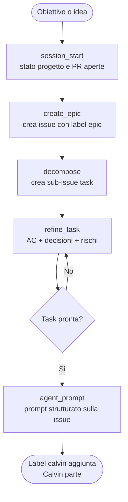
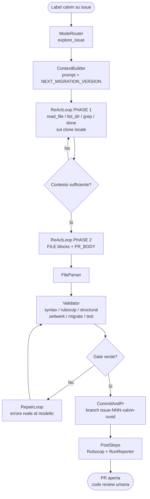

# Calvin

> *All the complexity in chat. All the density in the prompt.*

Calvin prende il nome da **Susan Calvin**, la robopsicologa di Isaac Asimov in *I, Robot* — la scienziata che capisce i robot meglio di quanto capisca gli esseri umani, perché li tratta come sistemi razionali da comprendere, non da temere.

Calvin è lo strumento che un tech lead usa per gestire un team di sviluppo autonomo. La pianificazione avviene in chat con Perplexity; l'esecuzione è affidata a Calvin — che legge la codebase, implementa e apre PR. Il team è Calvin.

La code review finale è umana. Il goal è produrre codice dove la CI — test inclusi — passa al primo colpo.

---

## Attori

| Attore | Ruolo |
|--------|-------|
| **Perplexity (chat)** | Guida il ciclo di pianificazione: epiche, decomposizione, raffinamento, prompt agente |
| **Calvin (GitHub Actions)** | Esegue i flow automatici: legge issue + contesto, chiama il modello, apre PR |
| **Codestral** (`codestral-latest`) | Modello LLM per tutte le call |

---

## Flusso 1 — Pianificazione in chat

Perplexity gestisce il ciclo di pianificazione tramite scenari. L'output finale è una issue raffinata con prompt pronto e label `calvin`.



---

## Flusso 2 — Esecuzione automatica

Calvin legge la issue, esplora la codebase, implementa e apre PR. La CI valida il risultato.



Il codice viene **eseguito prima** della PR: il clone del repo target già presente nel workflow
è il workspace su cui Calvin legge, scrive e valida. Se dopo `repair.max_attempts` un gate resta
rosso, la PR si apre marcata con la label `calvin:red` e l'output dell'errore nel body
(configurabile con `validation.open_pr_when_red`).

### Livelli di validazione

| Livello | Gate | Quando |
|---------|------|--------|
| `static` | `ruby -c`, rubocop, gate strutturali | default — nessun ambiente Rails richiesto |
| `full` | + `zeitwerk:check`, `db:migrate`, test mirati | richiede Postgres e `bundle install` del target |

I gate strutturali sono controlli deterministici che prima erano richieste in prosa nei prompt:
diff-guard anti-troncamento, allineamento fra file_plan e output, timestamp migration,
route senza controller, `validates` nei model.

---

## Flow automatici

| Label | Dove | Flow | Stato |
|-------|------|------|-------|
| `calvin` | issue repo target | `ExploreFlow` | attivo |
| `calvin-rubocop` | PR repo target | `PrRubocopFixFlow` | pianificato |

---

## Scenari chat

| Scenario | Trigger | Output |
|----------|---------|--------|
| `session_start` | inizio conversazione, status progetto | riepilogo PR aperte, issue in corso |
| `create_epic` | "crea epic" | issue con label `epic` |
| `decompose` | "decomponila" | sub-issue task collegate all'epica |
| `report_bug` | "traccia il bug" | issue bug strutturata |
| `refine_task` | "raffina la task" | issue aggiornata con AC, decisioni, rischi |
| `agent_prompt` | "scrivi il prompt" | prompt strutturato per esecuzione asincrona |
| `review_pr` | "review", numero PR | analisi PR con osservazioni |
| `update_context` | PR mergiata | aggiornamento `.agent.yml` / `overview.yml` |
| `calvanize` | "calvanize" | bootstrap Calvin su nuovo repo target |

---

## Struttura repo

```
bin/calvin.rb               entry point
bin/eval.rb                 eval harness — pass-rate su issue congelate (dry run)
lib/
  boot.rb                   requires, config, logging, feature flag, dry_run?
  mode_router.rb            label -> mode symbol
  explore_flow.rb           ExploreFlow orchestrator (6 step)
  react_loop.rb             ReActLoop PHASE 1 + 2
  context_builder.rb        prompt da issue + NEXT_MIGRATION_VERSION
  file_parser.rb            parsa FILE: blocks (fenced + plain) dall'output LLM
  workspace.rb              I/O sul clone locale del repo target
  repo_reader.rb            lettura: clone locale con fallback Contents API
  validator.rb              validation ladder + gate strutturali
  repair_loop.rb            rimanda gli errori reali al modello
  commit_and_pr.rb          commit + apre PR su repo target
  mistral_client.rb         HTTP client Mistral API
  github_client.rb          GitHub API wrapper
  rubocop_autocorrect.rb    autocorrect + commit
  rubocop_runner.rb         rubocop core + offese non correggibili
  run_reporter.rb           aggiorna runs.csv
  pr_body_builder.rb        body PR: validazione, token, RAG, firma
  flow_result.rb            Calvin::FlowResult
  post_steps.rb             RunReporter + RubocopAutocorrect
config/
  calvin.yml                tutte le costanti runtime
  prompts/rails/
    explore_system.md       system prompt PHASE 1
    implement_system.md     system prompt PHASE 2
test/                       unit test (bundle exec rake test)
data/evals/suite.yml        suite di eval
.rubocop.yml                stile Calvin (rubocop-rails-omakase)
.agent.yml                  manifesto AI
.scenarios.yml              catalogo scenari chat
overview.yml                contesto di alto livello
```

## Sviluppo

```bash
BUNDLE_GEMFILE=bin/Gemfile bundle install
BUNDLE_GEMFILE=bin/Gemfile bundle exec rake        # test + lint
BUNDLE_GEMFILE=bin/Gemfile bundle exec rake test   # solo unit test
```

Eval (nessun commit, nessuna PR — `CALVIN_DRY_RUN` è forzato):

```bash
ruby bin/eval.rb --suite data/evals/suite.yml --label baseline
```

---

## Branch naming

```
issue-{N}-{slug-titolo-issue}-calvin
```

---

## Tracciabilità

Ogni run è registrata in `backend/api/.calvin/reports/runs.csv` e `runs.md`.
Ogni PR Calvin contiene firma, token usage table e checkbox `- [ ] Approved`.

---

## Requirements

- Ruby, gem `octokit`, `faraday`, `dry-monads`
- Secrets: `GITHUB_TOKEN`, `MISTRAL_API_KEY`
- Label `calvin` e `calvin:red` create nel repo target
- Per `validation.level: full`: Postgres nel job e dipendenze del repo target installate

## Variabili d'ambiente

| Variabile | Effetto |
|-----------|---------|
| `CALVIN_TARGET_PATH` | path del clone locale del repo target (default `workspace.target_path`) |
| `CALVIN_VALIDATION_LEVEL` | `static` \| `full` — override di `validation.level` per singolo run |
| `CALVIN_DRY_RUN` | nessun commit, nessuna PR, nessun report |
| `CALVIN_MODEL` | override del modello |
