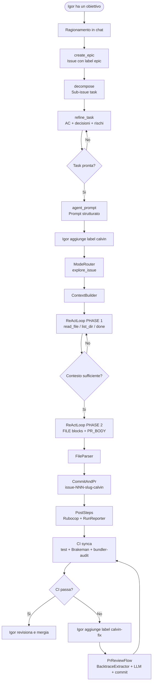

# Calvin

> *All the complexity in chat. All the density in the prompt.*

Calvin è un **framework di sviluppo autonomo**, non un copilot. Il suo scopo è sostituire il tech lead nel ciclo di pianificazione ed esecuzione: legge documentazione, crea epiche insieme a Perplexity, le decompone in task, le raffina fino a renderle eseguibili, poi le manda in sviluppo aprendo PR su una repo target.

La code review finale è umana. Il goal è produrre codice dove la CI — test inclusi — passa al primo colpo.

---

## Attori

| Attore | Ruolo |
|--------|-------|
| **Igor** | Crea issue, conferma scenari, aggiunge label, revisiona e mergia le PR |
| **Perplexity (chat)** | Guida il ciclo di pianificazione: epiche, decomposizione, raffinamento, prompt agente |
| **Calvin (GitHub Actions)** | Esegue i flow automatici: legge issue + contesto, chiama il modello, apre PR |
| **Codestral** (`codestral-latest`) | Modello LLM per tutte le call |

---

## Flusso completo



---

## Due modi di usare Calvin

### Modalità 1 — Chat con scenari (Perplexity Space)

Lavori in chat con Perplexity. Calvin non esegue codice: Perplexity gestisce il ciclo di pianificazione usando gli **scenari** definiti in `.scenarios.yml`.

```
session_start  →  stato del progetto, PR aperte, issue in corso
create_epic    →  issue con label epic
decompose      →  sub-issue task collegate all'epica
refine_task    →  issue con AC, decisioni, rischi, contesto
agent_prompt   →  prompt strutturato pronto per l'esecuzione
```

Quando una task è pronta, Igor aggiunge la label `calvin` → Calvin parte.

### Modalità 2 — Esecuzione automatica su repo target

Calvin è agganciato alla repo target via GitHub Actions. Quando riceve la label `calvin` su una issue, esegue `ExploreFlow`. Se la CI fallisce sulla PR, la label `calvin-fix` attiva `PrReviewFlow`.

---

## Flow automatici

| Label | Dove | Flow | Stato |
|-------|------|------|-------|
| `calvin` | issue synca | `ExploreFlow` | ✅ attivo |
| `calvin-fix` | PR synca | `PrReviewFlow` | ✅ attivo |
| `calvin-rubocop` | PR synca | `PrRubocopFixFlow` | 🔜 pianificato |

---

## Scenari chat

| Scenario | Trigger | Output |
|----------|---------|--------|
| `session_start` | Inizio conversazione, status progetto | Riepilogo PR aperte, issue in corso |
| `create_epic` | "crea epic" | Issue con label `epic` |
| `decompose` | "decomponila" | Sub-issue task collegate all'epica |
| `report_bug` | "traccia il bug" | Issue bug strutturata |
| `refine_task` | "raffina la task" | Issue aggiornata con AC, decisioni, rischi |
| `agent_prompt` | "scrivi il prompt" | Prompt strutturato per esecuzione asincrona |
| `review_pr` | "review", numero PR | Analisi PR con osservazioni |
| `update_context` | PR mergiata | Aggiornamento `.agent.yml` / `overview.yml` |
| `calvanize` | "calvanize" | Bootstrap Calvin su nuovo repo target |

---

## Struttura repo

```
bin/calvin.rb               ← entry point; ModeRouter + PostSteps
lib/
  boot.rb                   requires, config, logging
  mode_router.rb            label → mode symbol
  explore_flow.rb           ExploreFlow orchestrator
  pr_review_flow.rb         PrReviewFlow orchestrator
  react_loop.rb             ReActLoop PHASE 1 + 2
  context_builder.rb        builds prompt da issue + .calvin/*
  file_parser.rb            parsa FILE: blocks dall'output LLM
  commit_and_pr.rb          commit + apre PR su repo target
  mistral_client.rb         HTTP client Mistral API
  github_client.rb          GitHub API wrapper
  rubocop_autocorrect.rb    autocorrect + commit
  rubocop_runner.rb         rubocop core
  run_reporter.rb           aggiorna runs.csv + runs.md
  pr_body_builder.rb        firma PR body
  flow_result.rb            Calvin::FlowResult
  post_steps.rb             RunReporter + RubocopAutocorrect
config/
  calvin.yml                tutte le costanti runtime
  prompts/rails/
    explore_system.md       system prompt PHASE 1
    implement_system.md     system prompt PHASE 2
    pr_review_system.md     system prompt PrReviewFlow
.agent.yml                  manifesto AI — architettura, principi, workspace
.scenarios.yml              catalogo scenari chat
overview.yml                contesto di alto livello
```

---

## Branch naming

```
issue-{N}-{slug-titolo-issue}-calvin
```

---

## Tracciabilità

Ogni run è registrata in `backend/api/.calvin/reports/runs.csv` e `runs.md`.
Ogni PR Calvin contiene firma, token usage table e checkbox `- [ ] Approved`.

---

## Requirements

- Ruby, gem `octokit`, `faraday`, `dry-monads`
- Secrets: `GITHUB_TOKEN`, `MISTRAL_API_KEY`
- Label `calvin` e `calvin-fix` create nel repo target
