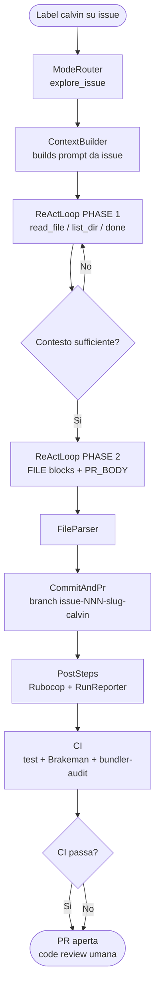

# Calvin

> *All the complexity in chat. All the density in the prompt.*

Calvin è lo strumento che un tech lead usa per gestire un team di sviluppo autonomo. La pianificazione avviene in chat con Perplexity; l'esecuzione è affidata a Calvin — che legge la codebase, implementa e apre PR. Il team è Calvin.

La code review finale è umana. Il goal è produrre codice dove la CI — test inclusi — passa al primo colpo.

---

## Attori

| Attore | Ruolo |
|--------|-------|
| **Perplexity (chat)** | Guida il ciclo di pianificazione: epiche, decomposizione, raffinamento, prompt agente |
| **Calvin (GitHub Actions)** | Esegue i flow automatici: legge issue + contesto, chiama il modello, apre PR |
| **Codestral** (`codestral-latest`) | Modello LLM per tutte le call |

---

## Flusso 1 — Pianificazione in chat

Perplexity gestisce il ciclo di pianificazione tramite scenari. L'output finale è una issue raffinata con prompt pronto e label `calvin`.


---

## Flusso 2 — Esecuzione automatica

Calvin legge la issue, esplora la codebase, implementa e apre PR. La CI valida il risultato.



---

## Flow automatici

| Label | Dove | Flow | Stato |
|-------|------|------|-------|
| `calvin` | issue repo target | `ExploreFlow` | attivo |
| `calvin-rubocop` | PR repo target | `PrRubocopFixFlow` | pianificato |

---

## Scenari chat

| Scenario | Trigger | Output |
|----------|---------|--------|
| `session_start` | inizio conversazione, status progetto | riepilogo PR aperte, issue in corso |
| `create_epic` | "crea epic" | issue con label `epic` |
| `decompose` | "decomponila" | sub-issue task collegate all'epica |
| `report_bug` | "traccia il bug" | issue bug strutturata |
| `refine_task` | "raffina la task" | issue aggiornata con AC, decisioni, rischi |
| `agent_prompt` | "scrivi il prompt" | prompt strutturato per esecuzione asincrona |
| `review_pr` | "review", numero PR | analisi PR con osservazioni |
| `update_context` | PR mergiata | aggiornamento `.agent.yml` / `overview.yml` |
| `calvanize` | "calvanize" | bootstrap Calvin su nuovo repo target |

---

## Struttura repo

```
bin/calvin.rb               entry point
lib/
  boot.rb                   requires, config, logging
  mode_router.rb            label -> mode symbol
  explore_flow.rb           ExploreFlow orchestrator
  react_loop.rb             ReActLoop PHASE 1 + 2
  context_builder.rb        builds prompt da issue + .calvin/*
  file_parser.rb            parsa FILE: blocks dall'output LLM
  commit_and_pr.rb          commit + apre PR su repo target
  mistral_client.rb         HTTP client Mistral API
  github_client.rb          GitHub API wrapper
  rubocop_autocorrect.rb    autocorrect + commit
  rubocop_runner.rb         rubocop core
  run_reporter.rb           aggiorna runs.csv + runs.md
  pr_body_builder.rb        firma PR body
  flow_result.rb            Calvin::FlowResult
  post_steps.rb             RunReporter + RubocopAutocorrect
config/
  calvin.yml                tutte le costanti runtime
  prompts/rails/
    explore_system.md       system prompt PHASE 1
    implement_system.md     system prompt PHASE 2
.agent.yml                  manifesto AI
.scenarios.yml              catalogo scenari chat
overview.yml                contesto di alto livello
```

---

## Branch naming

```
issue-{N}-{slug-titolo-issue}-calvin
```

---

## Tracciabilità

Ogni run è registrata in `backend/api/.calvin/reports/runs.csv` e `runs.md`.
Ogni PR Calvin contiene firma, token usage table e checkbox `- [ ] Approved`.

---

## Requirements

- Ruby, gem `octokit`, `faraday`, `dry-monads`
- Secrets: `GITHUB_TOKEN`, `MISTRAL_API_KEY`
- Label `calvin` creata nel repo target
